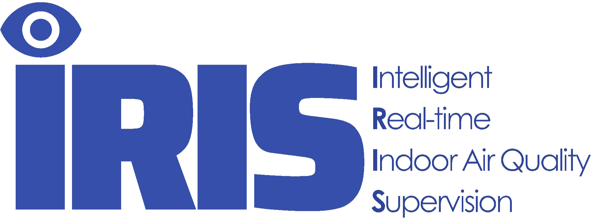

# IRIS Landing Page

  

  <strong>Intelligent Real-time Indoor Air Quality Supervision</strong>

IRIS is a graduation thesis project at Ho Chi Minh City University of Technology (HCMUT), VNU-HCM. The project explores how camera-derived measurements, environmental sensors, physics-based modeling, and AI analytics can be connected through a Digital Twin pipeline for indoor air-quality supervision.

This repository contains the public landing page for the project.

## Live Website

[View the IRIS landing page](https://fufu3105.github.io/landing-page/)

## Project Focus

IRIS is designed to support a clearer and more actionable understanding of indoor environments by combining four complementary capabilities:

1. **Vision-based data acquisition** — digitize readings from existing gauges without requiring every device to be replaced.
2. **Multi-source validation** — compare camera readings, sensor data and model estimates instead of relying on one measurement source.
3. **Forecasting and anomaly awareness** — identify unusual conditions and examine how indoor air quality may change over time.
4. **Digital Twin monitoring and decision support** — present trends, alerts and recommendations that help users decide when attention action may be needed.

IRIS focuses on monitoring, analytics, forecasting, alerts, recommendations and decision support. 

## Project Team

**Supervisor**

- Assoc. Prof. Võ Thị Ngọc Châu

**Student Researchers**

| Student | Student ID |
| --- | --- |
| Trương Hoàng Phú | 2352924 |
| Trịnh Gia Hiệp | 2352343 |
| Nguyễn Ngọc Cát Hà | 2352288 |

**Institution**

Faculty of Computer Science & Engineering 
Ho Chi Minh City University of Technology — VNU-HCM

## Project Status

IRIS is a research-driven engineering project under development. Interface values and product screens shown on the landing page are illustrative and should not be interpreted as validated experimental results.
